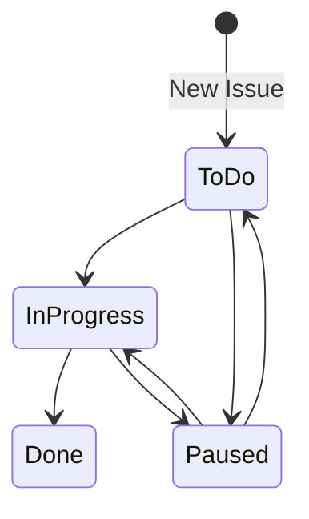

## Tst

It's easiest to think of processes as a collection of states and transitions, this makes it easy to create State diagrams to model and show the process or workflow.

Example: 

In our fictional company _YesButNo Inc._, issues sent over to the Service Desk team are missing SLA's. The metrics indicate that the volume of reported issues has remained constant but that time to complete an issue has increased, the team's manager has investigated and found that the complexity of issues hasn't changed. The manager asks the staff what might be causing the slowdown and is given a long list of problems:

- Reporters aren't giving enough details, requiring a follow-up conversation
- The ticketing system is slow
- Sometimes a task is started near end of shift and has to be assigned to someone else before completion
- Figuring out how the solve the issue is hard
- There's too many distractions during the shift
- There's competing priorities
- etc.

The manager isn't sure how to approach fixing the issue and has asked for our help.

### Investigation & Analysis

We know that the team uses a ticketing system to track all issues, so we start our analysis by looking at the ticket workflow. We discover that they have the following statuses configured for their tickets:

- To Do
- In Progress
- Paused
- Done

We can easily map these out in a State Diagram:

We know that a new ticket is created when an issue is reported, but at this point it's unclear why or when an issue is transitioned from _To Do_ to _In Progress_, or from _In Progress_ to _Done_.  The _Paused_ status also piques our interest, we can see the value but wonder how long a ticket stays in this status.

These are questions we'll have to ask the team!

Another question that comes to mind is, has the amount of time that tickets sit in a specific status changed? We run a report and determine the following:

|Status|Avg. Time (this month)|Avg. Time (this month last year)|
|-|-|-|
|To Do|15m|10m|
|In Progress|120m|125m|
|Paused|403m|100m|
|Done| na | na |

