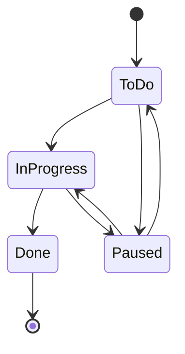
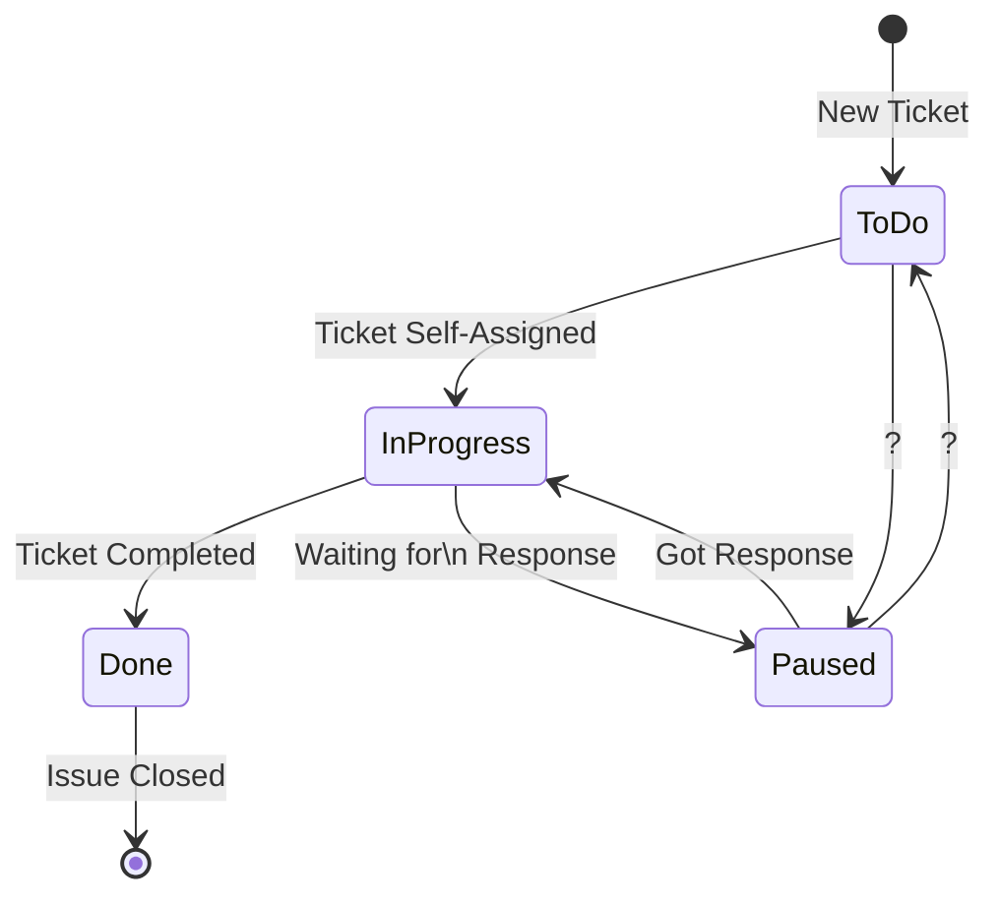
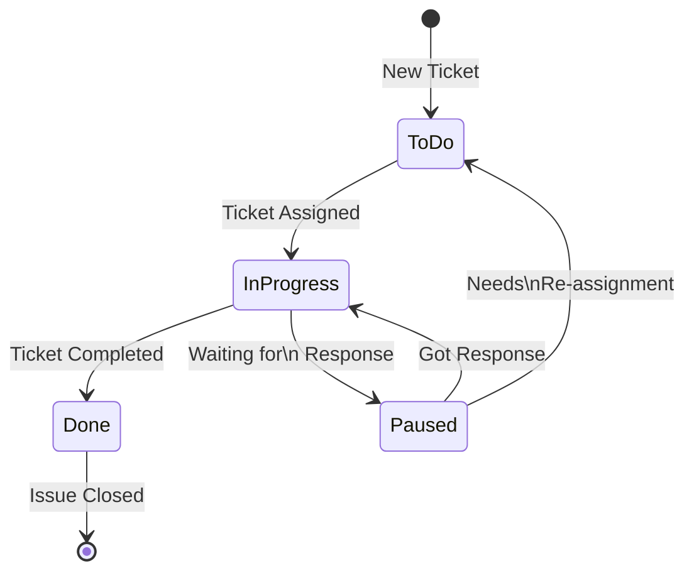

## State Diagrams

You can think of processes as a collection of states and transitions, this makes it easy to create State diagrams to model and show the process or workflow.

_Note: For this example we'll go bottom-up, starting with the ticket flow and moving up from there to fill in some gaps, but we'll stop short of more in-depth analysis and diagramming tools._

### Investigation & Analysis

In our fictional company, _YesButNo Inc._, issues sent over to the Service Desk are ticketed and run through a defined workflow until they are completed, we've been asked to take a look at and document the process.

Any easy place to start when talking about Processes that include ticketing systems is to use a state diagram to map it out.

We know that the team uses a ticketing system to track all issues, so we start our analysis by looking at the ticket workflow. We discover that they have the following statuses configured for their tickets:

- To Do
- In Progress
- Paused
- Done

The `To Do` status can be moved to `In Progress` which can go to `Done`. We also discover that anything in `To Do` or `In Progress` can be moved to the `Paused` status and vice-versa. The issue is considered closed when the ticket is marked as `Done`.

We can easily map these out in a State Diagram:

We know that a new ticket is created when an issue is reported, but at this point it's unclear why or when an issue is transitioned from `To Do` to `In Progress`, or from `In Progress` to `Done`.  The `Paused` status also piques our interest, we can see the value but wonder how long a ticket stays in this status.

After some discussion with the team we discover when and why transitions happen, we can add these to the diagram:

We note that in this workflow, only tickets that are actively being worked are considered `In Progress`, tickets are not assigned until the assignee is ready and able to work on the ticket.

The team gave us varying answers as to why and when an issue in `To Do` would transition to `Paused`. To get more insight we look through ticket history and note that tickets are often moved from `To Do` to `Paused` with no explanation given, and when an explanation is given it is not due to waiting for information.

Since this could be indicative of a problem, we look through reporting metrics and dashboards. We discover that management monitors the number of tickets and average time a ticket sits in `To Do`, and that by moving tickets to `Paused` the team keeps their metrics within guidelines.

This simple diagram and the investigation required to create it has shown us that the metrics management uses for reporting do not tell the whole story. We suggest adjusting the workflow such that the `To Do` state cannot transition to `Paused` but leave the ability for `Paused` to transition to `To Do`. 

We also discuss with management the need to monitor and report on all statuses, it's vital for them to know if tickets are remaining in `Paused` for several days because the team isn't getting responses as this will hurt team morale and must be dealt with at an organizational level.

### Wrapping up

While fictional, I want to point out that this type of thing isn't a failure of a person or team, constraints and pressure have a way of creating process work-arounds. It's managements responsibility to ensure that their teams have the necessary bandwidth to complete the tasks, and teams must be able and willing to speak up. It is better for everyone to know that you're missing targets, sweeping them under the rug will only add stress and exacerbate the problems over time.

A state diagram is just one piece of a large puzzle, it's useful for mapping processes that have states and transitions but does not allow for more nuanced information.