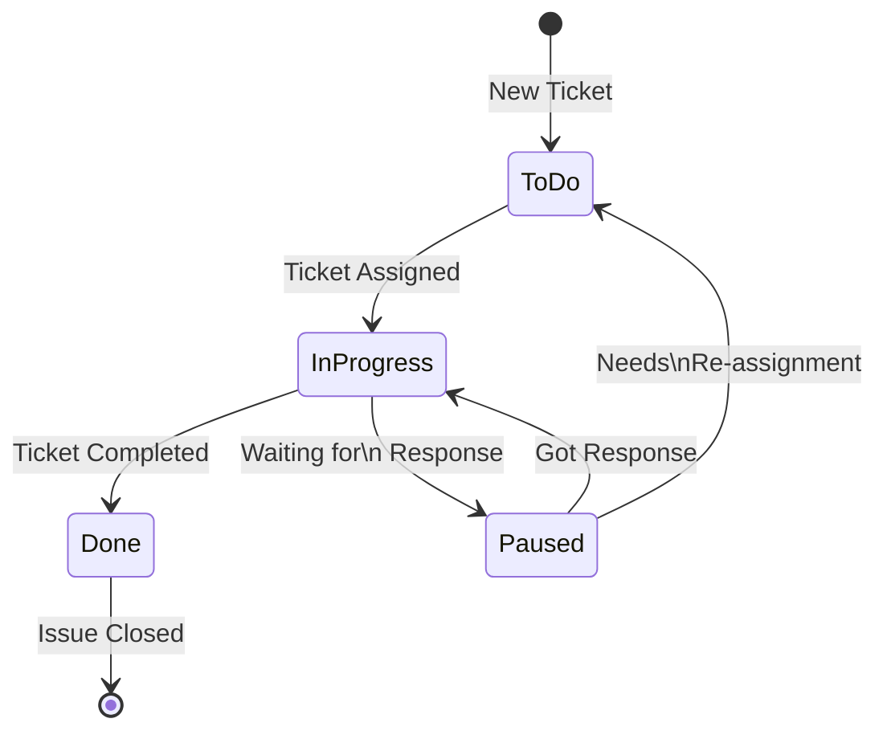
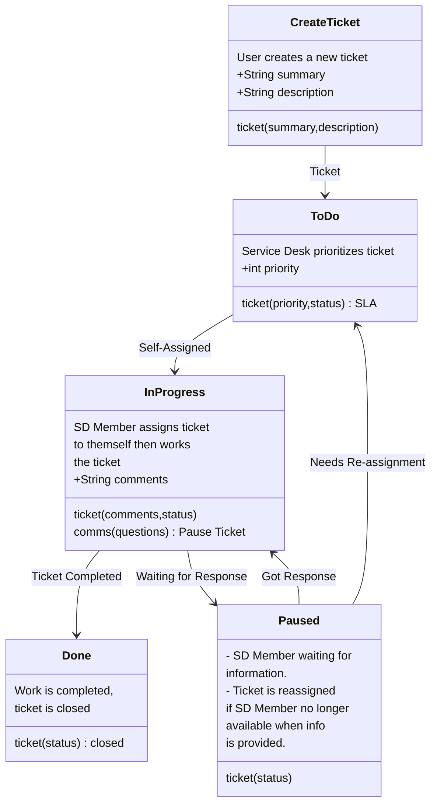
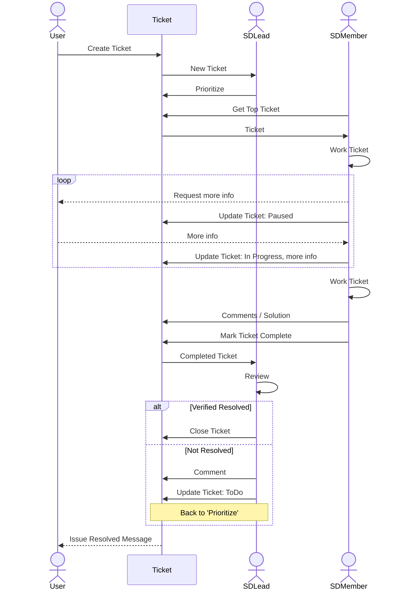
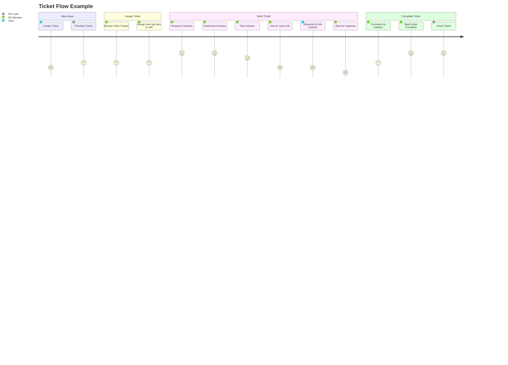

## Modeling Ticket Flows With Diagrams

Not all processes use tickets, but for those that do it is helpful to model them out in diagrams to gain additional insight and consensus on where improvements can/need to be made. I've additionally found it helpful for readers to include ticket flow diagrams within procedure documentation.

I'm using a fairly simple example here to show the diagrams and how they might be used, I'm intentionally not diving into how the example process can be improved.

### State Diagrams

I've discussed [State Diagrams for ticket flows before](state-diagrams.md), where I landed on this diagram to illustrate a simple ticket flow a Service Desk might use:

### Class Diagrams

We can build on our State Diagram by **misusing** a Class Diagrams, the structure of the diagram lends itself to illustrating additional information like Inputs, Outputs, and sub-processes.

### Sequence Diagram

Mapping as a Sequence Diagram can also be helpful. 

What stands out in the diagram below is that the communication between the Service Desk and the User bypasses the ticketing system, this could lead to situations where the ticket does not contain all the information because it relies on the service desk member to add any back and forth to the ticket description.

### User Journey

Taking a page out of Product Management, it can be helpful to map the User Journey for ticket flows. 

Try to think of ways to increase the happiness during the low steps. As an example, when the service desk member needs to ask for more information they're not happy, and the user isn't happy having to follow-up to the request, a possible solution is to adjust the ticket template to include examples or questions that reduce the likelihood of having to follow-up.

