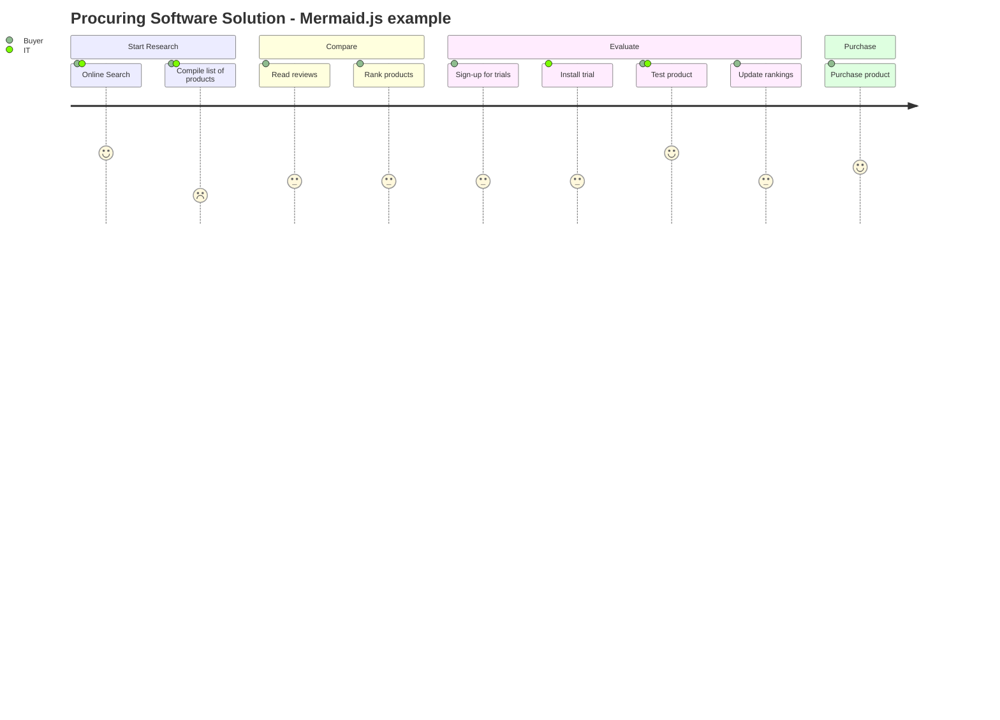

### Overview

The *User Journey* (or Customer Journey) illustrates the journey a customer takes when using your product, typically represented as a chart but can be done in a table. The most common journey that's modelled is the new user acquisition flow (some variation of: awareness --> evaluation --> purchase --> retention --> advocacy) but the concept can be applied to any user flow in the product.

User Journeys aren't limited to B2C products or to websites/landing pages, they could also be applied to experiences like 'Creating service desk tickets in Slack'.

User Journey's can be created for each [persona](2022-08-16_personas.md), this helps identify how different groups of people engage with the product.

#### A Simple Template

---

**Persona:**   
**Scenario:** 

| | Awareness | Evaluation | Purchase | Retention | Advocacy |
|-|-|-|-|-|-|
| **User Actions** | | | | | |
| **User Experience** | | | | | |
| **Feelings** (+ or -) | | | | | |
| **Pain Points** | | | | | |
| **Opportunities** | | | | | |

---

#### As a Diagram

User Journeys can come in various different forms, [Mermaid.js](https://mermaid-js.github.io/mermaid/#/user-journey) even supports a graphical view:

### Resources

- [edit.org](https://edit.org/blog/free-customer-journey-map-templates) has a good selection of online-editable templates
- [userinterviews.com](https://www.userinterviews.com/blog/best-customer-journey-map-templates-examples) has a good write-up with downloadable templates
- [mermaid-js.github.io](https://mermaid-js.github.io/mermaid/#/user-journey)