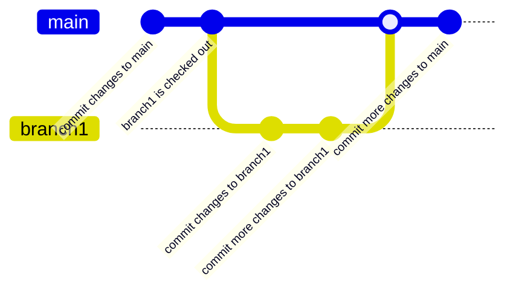

Most of this isn't Github specific but since I mostly use Github for my Git I'll leave it here.

## Git Workflow

At a very high level, consider the following as the layout for repositories stored in git:

On the github server (remote):

```
Origin
  ├─ Main
  ├─ Branch 1
  ├─ Branch 2
  └─ ...
```

On your computer (local):

```
Local
  ├─ Main
  ├─ Branch 1
  ├─ Branch 2
  └─ ...
```

Notice that there are two: _Origin_ and _Local_?

- ***Origin*** - this is a _remote_ server and is the origin of the code
- ***Local*** - this is a repository that is stored on your computer. When you make changes they are applied here first, then later _pushed_ to Origin. You can think of it like a local working copy or a staging area.

Inside a repo, the top-level of a project is the _Main_ branch, this is the approved version of files (code, documents, images, etc). In the case of _Origin_, typically the _Main_ branch is what is deployed to production.

_Branches_ are used to separate any changes from _Main_ - that is, you work in a _Branch_, test that _Branch_, and know that it's good before things go to _Main_.

Once a _Branch_ has been tested and everything looks good, a _Pull Request_ is done. The _Pull Request_ is a request for another person to review and ultimately accept or reject the changes. If accepted the changes are _merged_ into _Main_ and become part of the Production code.

So the workflow is generally:

1. Pull the code from Origin into your Local
1. Work on Local
1. Commit your changes on Local to your Local repository
1. Push your changes to Origin

Work should be done on a Branch instead of Main. For example, in the following diagram we `checkout` branch1, do two commits to branch1, then `merge` it back into main:



### Working on an existing Branch

#### Before you make changes

1. Make sure you have the latest version on your local:

    ```zsh
    $ git pull origin {branch name}
    ```

    If you're already up to date you'll see something like:

    ```zsh
    From github.com:{user}/{repo}
    * branch            main       -> FETCH_HEAD
    Already up to date.

    ```

    If you're not up to date you'll see information on which files are being pulled down from Origin - ***keep an eye out for errors***.

#### Add files/changes to your local repo

1. When you make changes and save files, you can see what's changed on your local:

    ```zsh
    $ git status
    ```

    This tells you what branch you're on and what files have changed.

2. When you're good with the changes, you have to _add_ the files to be _committed_ to your Local git, there's a few ways to do this:

    To add ***all*** files:

    ```zsh
    $ git add .
    ```

    OR:

    ```zsh
    $ git add --all
    ```

    To add a ***single*** file:

    ```zsh
    $ git add <filename>
    ```

#### Commit the changes to your local repo

1. When all the files have been added to your Local git, you "commit" them with a message about your changes:

    ```zsh
    $ git commit -m "your message/description"
    ```

    Example 1: `git commit -m "Added information for new users to the landing page"`

    Example 2: `git commit -m "Fixed bug issue-31"`

    **Note:** _if you want/need to add more information, leave out the -m, it will take you into a longform description editor (if you do that accidentally: hit `Escape`, then type `wq`, then press `Enter`)_

#### Push your changes to Origin

1. Do git status again:

    ```zsh
    $ git status
    ```

    You should see:
 
    ```zsh
    On branch {branch name}
    nothing to commit, working tree clean
    ```
    
    If it shows uncommitted files, you'll want to commit them now.

2. You can now Push your changes to Origin for someone to review:

    ```zsh
    $ git push origin {branch name} 
    ```

----

#### Recap

So, a recap... working on the Branch SEUSS-1234

1. Pull the code from Origin into your Local:

    `$ git pull origin SEUSS-1234`

1. Work on Local - check if you have any untracked files and what Branch you're on:

    `$ git status`

1. Commit your changes on Local to your Local repository:

    First add all your files:

    `$ git add --all`

    Next commit them:

    `$ git commit -m "your message/description"`

1. Push your changes to Origin

    Verify all your files are tracked:

    `$ git status`

    Then push it up:

    `$ git push origin SEUSS-1234`

### Creating a new Branch on an existing Repo

1. In your working directory (create one first if you haven't already), clone Main from Origin to your Local:

    ```zsh
    $ git clone {URL}
    ```

    You can find the {URL} in GitHub, look for the _Clone or download_ button, then select _Clone with SSH_.

1. This clones the code into a new subdirectory, enter that directory:

    ```zsh
    $ cd {directory}
    ```

1. Checkout Main:

    ```zsh
    $ git checkout main
    ```

1. For fun, pull Main from Origin... just in case someone merged something since you checked it out:

    ```zsh
    $ git pull origin main
    ```

1. Checkout a new Branch:

    ```zsh
    $ git checkout -b {branch name}
    ```

    Where {branch name} is the name you're giving this Branch. 
1. Push the new Branch to Origin:

    ```zsh
    $ git push origin {branch}
    ```
    This will create the Branch on Origin.