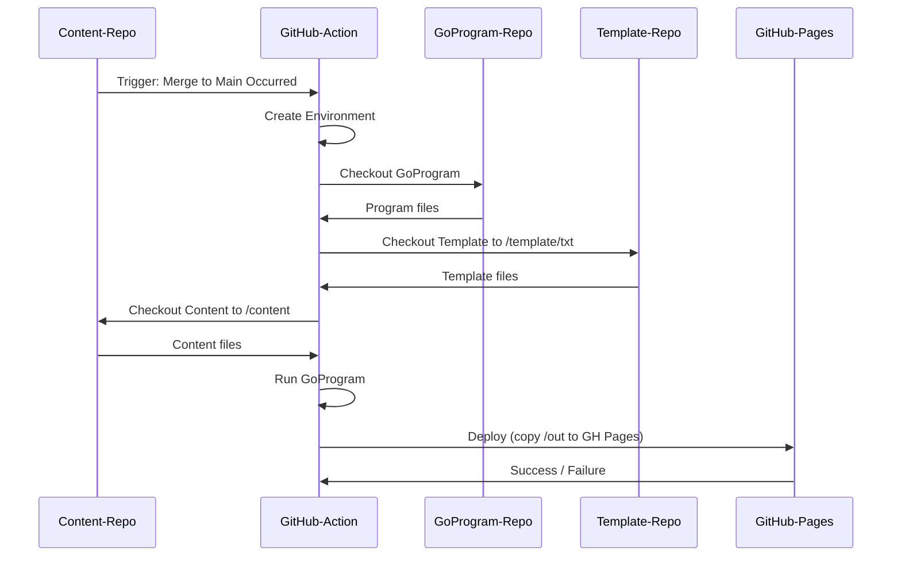

### Requirements

**Purpose:** 

Automatically build my website (andreaswiebe.com) by converting a directory-tree containing markdown files into static html pages when commits are merged to main. Take the opportunity to learn Go and GitHub actions.

**Intro**
|||
|-|-|
| **For** | Myself |
| **Who**| Needs to build a website from my notes|
| **The** |go-pubsite tool is a static website generator that takes a directory structure with markdown files and an html template directory then converts them to a static html website|
| **That** |Doesn't require a lot of configuration files|
| **Unlike**| Jekyll and Hugo|
| **This Product** |Creates a static html website using markdown and a template without requiring multiple configuration files within the content directories.|

**Who is it for?**

*go-pubsite* is primarily for myself, I want to focus on writing content, not configuration files.

**Background**

 I found myself reluctant to add more of my notes to my notes repo due to the overhead of having to add configuration files every time I wanted a new category. Since I wanted to learn some Go and more about GitHub Actions I decided to create new tooling instead of taking one of the more robust pre-existing solutions.

**Market Assumptions**

- I will be the only person using *go-pubsite*

**Market Opportunities**

- Not applicable as this is a personal project.

**Goals**

- Create a static website generator with minimal configuration files
- Learn some Go
- Learn GitHub Actions

**Features / Functionality**

- Core Elements
  - Only one configuration file required
    - All other configuration to be in the frontmatter of the markdown
  - Traverse a directory tree and:
    - Convert markdown files to HTML, inject them into a template, and store to /out
      - Support Mermaid.js in markdown
    - Copy non-markdown files to /out
    - Create navigation elements
  - Build in a way that content, templates, and the *go-pubsite* program each have their own repo
  - Use a GitHub action to convert the notes repo into static html files and deploy to GitHub Pages
- Look and Feel
  - *go-pubsite* will run from the CLI, it expects there to be:
    - A directory `/content` that contains subdirectories with markdown files
    - A directory `/template` that contains a HTML template in a subdirectory (i.e. /template/txt)
    - A directory `/.config` that contains a single `config.yaml` for the site configuration

**Release Criteria**

- Program can traverse content directory and output well-formed HTML to the output directory

**Timeline & Constraints**

- No budget or dependencies, I am the only resource.
- Can only be worked on over weekends and when time allows, attempt to accomplish it within 16 hours

---
### Current Release Details

At a high-level, this Go program iterates through a content directory, converts markdown files to HTML, and copies static files to an output directory. The program expects and requires the `/content` and `/templates` directories to exist and have appropriate files within them.

Repos: 

- [go-pubsite](https://github.com/queue-bit/go-pubsite/releases/tag/v1.0.0)
- [template-txt](https://github.com/queue-bit/template-txt)
- [content - queue-bit.github.io](https://github.com/queue-bit?tab=repositories)

#### Directory Structure


```treeview
./
|
├── main.go
├── content
|   |
|   ├── index.md                      // Becomes the homepage
|   ├── .config                       // Contains site configuration data
|   |    ├── config.yaml              // The site configuration file
|   |    └── redirects.yaml           // The optional redirects file
|   ├── _media                        // Non-markdown files for attachment (images, etc)
|   |    ├── image-file.jpg
|   |    ├── pdf-file.pdf
|   |    └── etc.
|   ├── 1_first-section                     // 1st section page (1st level menu item)
|   |    ├── _first-category                // 1st category page (2nd level menu item)
|   |    |   ├── first-markdown-file.md     // Article page (3rd level menu item)
|   |    |   └── second-markdown-file.md
|   |    └── second-category                // 2nd category page (2nd level menu item)
|   |        └── first-markdown-file.md
|   ├── 2_second-section                    // 2nd section page (top-level menu item)
|   |    └── _first-category
|   |        └── first-markdown-file.md
|   └── 3_third-section
|       └── _first-category
|          ├── first-markdown-file.md
|          └── second-markdown-file.md
├── templates                   // The HTML templates...
|   └── txt                     // I'm using txt...
|       ├── assets
|       ├── base
|       |    └── base.html      // ... which I tweaked to work with golangs HTML/Template
|       └── images
└── /out/
```

*Note: For brevity I've left out some files*

#### Configuration

The site configuration is done in `/content/.config/config.yaml`, it should be of the following format:

```yaml
title:          The site title
domain:         The domain of the site (www.example.com)
baseurl:        The base url of the site (http://www.example.com)
templatename:   The template name/directory (currently only supports "txt")
email:          Your email address (caution, this displays on the site)
github:         Link to your GitHub account (https://github.com/example-user)
linkedin:       Link to your LinkedIn account (https://www.linkedin.com/in/example-user)
twitter:        Link to your Twitter account (https://twitter.com/example-user)
mastodon:       Link to your Mastodon account (https://mastodon-instance@user)
facebook:       Link to your Facebook account (https://www.facebook.com/)
analytics:      Analytics Code (HTML with script tag)
ogtype:         Default OpenGraph type, can be overridden in the page's frontmatter
author:         Default OpenGraph author, can be overridden in the page's frontmatter
ogimage:        Default OpenGraph image, can be overridden in the page's frontmatter
faviconpath:    Relative path to the favicon directory
```

##### Redirects

Optionally, you can create page redirects by creating a `/content/.config/redirects.yaml` file. This is a simple redirect feature using the `http-equiv="refresh"` metatag since GitHub Pages doesn't support htaccess files.

This file is only processed if it exists, do not create the file if you have no redirects to do.

`/content/.config/redirects.yaml` should use relative links and be in the following format:

```yaml
redirect:
  - from: "/about/about-me/"
    to: "/"
  - from: "/about/about-site/"
    to: "/"
  - from: "/product-management/"
    to: "/work-notes/product-management/"
```

*Note that this does not work for URL's that end with extensions (i.e. `/test/example.html` will not work, `/test/example` will)*


#### Navigation and URL Structure

The Navigation is designed to mirror the directory structure of the `content` directory, such that:

1. **Sections** show up in the Nav as top-level items
   - Sections must always start with a number followed by an underscore (eg. `1_`), the number determines its position in the menu
   - Each section gets an index page with links to all content within the section
   - Everything after the number and underscore becomes the section name 
     - For titles: dashes are removed and title case is applied
1. **Categories** show up in the Nav under the top-level (section) items
   - Categories must always start with a underscore `_` and be inside a section directory
   - Each category gets an index page with links to all content within the category
   - Everything after the underscore becomes the category name 
     - For titles: dashes and underscores are removed and title case is applied
   - Note that categories are sorted alphabetically, there is no override for different sorting methods
1. **Markdown files** show up in the Nav under the Categories
   - Filenames should have no spaces and must end with a `.md` extension
   - Frontmatter is required in each file to define (at minimum):
     - Article Title
     - Article Intro (can be an empty string)
     - Article Tags (can be an empty string)


#### Markdown File Content

##### Frontmatter

Frontmatter is **required** in markdown files and is defined at the top of the document between three dashes `---`. 

Currently supported tags:

|Tag | Note |
|-|-|
|`title`      | The title of the page, also displayed in menus|
|`intro`      | Displays between the Header and the Table of Contents in my template|
|`tags`       | Used in OpenGraph metadata|
|`description`| (Optional) used for meta tags|
|`ogtype`     | (Optional) used in OpenGraph metadata. Default is set in the site config|
|`ogimage`    | (Optional) OpenGraph image for the specific article/page. Default is set in the site config|
|`author`     | (Optional) used in OpenGraph metadata. Default is set in the site config|
|`date`       | (Optional) passed to the template, shows on article pages and used in OpenGraph metadata|

Minimal Frontmatter Example:

```yaml
---
title:  "A sample title"
intro: ""
tags: "example,title,sample"
---

### Your content here.
```

##### Table of Contents

The program will automatically generate a Table of Contents for markdown files that have more than two headings.

##### Mermaid.js Diagrams

The program supports [mermaid.js](https://mermaid-js.github.io/mermaid/) diagrams in the markdown files, to use them you need to encapsulate them with three backticks and the word mermaid:

````text

````

Will be displayed in the webpages as:


##### Mixed Markdown and HTML

HTML is allowed in the markdown files and will be passed along as-is.

#### Building and deploying a site with go-pubsite

Please be sure to read and understand the [license](https://github.com/queue-bit/go-pubsite/blob/main/LICENSE) before using this.

This site is broken up into three repositories, to build the site a GitHub Action is run when the Content repo has changes committed to the Main branch. The action creates an Ubuntu environment, then:

1. Checks out the Go program repository
1. Checks out the Template repository to /template/txt
1. Checks out the Content repository to /content
1. Runs the Go program
1. Deploys the output to GitHub Pages

**Taking a few liberties, this could be illustrated as:**



##### Sample GitHub Action to Build the Site

This is how my GitHub Action is setup, you can also [view it on GitHub](https://github.com/queue-bit/queue-bit.github.io/blob/main/.github/workflows/build-site.yaml).

Note that since I control all of the repositories I checkout the Main branch. If you're planning on using this I suggest you pull by the version tags instead (or fork the code).

```yaml
name: Deploy Site to Pages

on:
  # Runs on pushes targeting the default branch
  push:
    branches: ["main"]

  # Allows you to run this workflow manually from the Actions tab
  workflow_dispatch:

# Sets permissions of the GITHUB_TOKEN to allow deployment to GitHub Pages
permissions:
  contents: read
  pages: write
  id-token: write

# Allow one concurrent deployment
concurrency:
  group: "pages"
  cancel-in-progress: true

# Default to bash
defaults:
  run:
    shell: bash

jobs:
  # Build job
  build:
    runs-on: ubuntu-latest
    env:
      working-directory: ./
    steps:
      - name: Set up Go
        uses: actions/setup-go@v3
        with:
          go-version: 1.18    
      # First we check out the Go program
      - name: Checkout queue-bit/go-pubsite
        uses: actions/checkout@v3
        with:
          repository: queue-bit/go-pubsite
          path: './'
      # Second we check out the Template
      - name: Checkout queue-bit/template-txt
        uses: actions/checkout@v3
        with:
          repository: queue-bit/template-txt
          path: './templates/txt'          
      # Third we check out the Content
      - name: Checkout repo
        uses: actions/checkout@v3
        with:
          path: './content'
      - name: Setup Pages
        id: pages
        uses: actions/configure-pages@v2
      # Run the Go Program
      - name: Build
        run: |
          go run main.go
      - name: Upload artifact
        uses: actions/upload-pages-artifact@v1
        with:
          path: ./out

  # Deployment job
  # Deploy the /out directory to GitHub Pages
  deploy:
    environment:
      name: github-pages
      url: ${{ steps.deployment.outputs.page_url }}
    runs-on: ubuntu-latest
    needs: build
    steps:
      - name: Deploy to GitHub Pages
        id: deployment
        uses: actions/deploy-pages@v1

```

---

### v1.0.0 Changes

Split the solution into three repositories:

#### Go Program

Repo: [go-pubsite](https://github.com/queue-bit/go-pubsite/releases/tag/v1.0.0)

At a high-level, this Go program iterates through a content directory, converts markdown files to HTML, and copies static files to an output directory. 

Features:

- Frontmatter processing
- Config file
- Auto-generates Table of Contents for pages with more than two headings
- Mixed markdown with HTML is supported
- Supports Mermaid.js Diagrams
- Copies non-markdown files over to output

#### Content

Repo: [queue-bit.github.io](https://github.com/queue-bit/queue-bit.github.io)

The content repo contains all the notes that show up on this site. Notes are organized into directories, the directory naming and structure dictates the navigation on the website.

Features:

- Single config file (`/content/.config/config.yaml`)
- Media directory for file attachments/images (`/content/_media`)
- 

#### Template

Repo: [template-txt](https://github.com/queue-bit/template-txt/releases/tag/v1.0.0)

The template being used is a modified version of:

> [TXT by HTML5 UP](https://html5up.net/txt)  
> html5up.net | @ajlkn  
> Free for personal and commercial use under the CCA 3.0 license (html5up.net/license)

It's modified to be used with the `html/template` library in go, and more specifically the go-pubsite program.

---

### v2.0.0 Changes

Released as a new major version as many of the changes would break processing of content created for V1.0.0

#### Go Program

Changes:

- Expanded config file supported tags
  - Added: ogtype, author, ogimage, faviconpath
- Expanded frontmatter to include new tags and replace poorly named tags
  - Added: intro, ogtype, author, description, date, ogimage
  - Removed: excerpt
- Added processing for frontmatter tag "tags"
- Fixed Table of Contents processing (no more broken HTML)
- Removed `.html` from auto-generated links (GitHub Pages does pretty-url's out of the box)

#### Template

Changes:

- Added support for opengraph tags (ogtype, author, description, url, date, image)
- Added support for favicons
- Tweaked to check if optional vars exist before rendering html
- Added `prism` css and js for nicer code-block formatting

<br/><br/><br/>

---

### v2.1.0 Changes

Minor revision with some added functionality, this should not impact any existing v2.0.0 integrations.

#### Go Program

Changes:

- Now automatically creates a sitemap.xml file in the root
  - Autosets priority and change frequency depending on page type (0.5 for article, 1 for section, 0.8 for category)
- New feature: Redirects
  - A simple redirect feature using the `http-equiv="refresh"` metatag
  - Auto-creates the redirect pages if `/content/.config/redirects.yaml` exists
- Metadata, including paths and sitemaps are now global variables instead of being passed from function to function 
  - Eliminates calling a function with file loading multiple times
  - Simplifies function calls
- Changed console output to log output


#### Template

Changes:

- Bugfix for breadcrumb nav not showing on section and category pages [Issue](https://github.com/queue-bit/template-txt/issues/5)
- Added `og:site_name` meta tag

<br/><br/><br/>

---

### v2.1.1 Changes

Minor revision, adds Facebook and Mastodon URL's to the config file and template.

Changes:

- New tags added to config file (mastodon, facebook)

#### Template

Changes:

- Support for optional Mastodon and Facebook social icons/links


