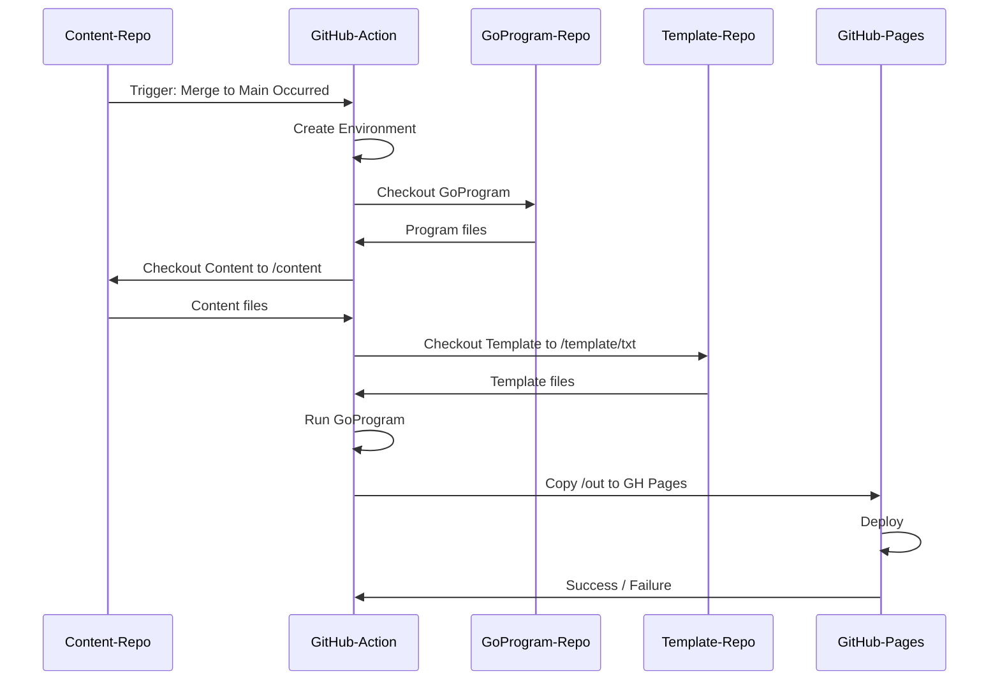

## Requirements

### Purpose

Automatically build my website (andreaswiebe.com) by converting a directory-tree containing markdown files into static html pages when commits are merged to main. Take the opportunity to learn Go and GitHub actions.

#### Intro
|||
|-|-|
| **For** | Myself |
| **Who**| Needs to build a website from my notes|
| **The** |go-pubsite tool is a static website generator that takes a directory structure with markdown files and an html template directory then converts them to a static html website|
| **That** |Doesn't require a lot of configuration files|
| **Unlike**| Jekyll and Hugo|
| **This Product** |Creates a static html website using markdown and a template without requiring multiple configuration files within the content directories.|

#### Who is it for?

*go-pubsite* is primarily for myself, I want to focus on writing content, not configuration files.

##### Background

 I found myself reluctant to add more of my notes to my notes repo due to the overhead of having to add configuration files every time I wanted a new category. Since I wanted to learn some Go and more about GitHub Actions I decided to create new tooling instead of taking one of the more robust pre-existing solutions.

##### Market Assumptions

- I will be the only person using *go-pubsite*

##### Market Opportunities

- Not applicable as this is a personal project.

##### Goals

- Create a static website generator with minimal configuration files
- Learn some Go
- Learn GitHub Actions

### Features / Functionality

#### Core Elements

- Only one configuration file required
  - All other configuration to be in the frontmatter of the markdown
- Traverse a directory tree and:
  - Convert markdown files to HTML, inject them into a template, and store to /out
    - Support Mermaid.js in markdown
  - Copy non-markdown files to /out
  - Create navigation elements
- Build in a way that content, templates, and the *go-pubsite* program each have their own repo
- Use a GitHub action to convert the notes repo into static html files and deploy to GitHub Pages

#### Look and Feel

*go-pubsite* will run from the CLI, it expects there to be:

1. A directory `/content` that contains subdirectories with markdown files
2. A directory `/template` that contains a HTML template in a subdirectory (i.e. /template/txt)
3. A directory `/.config` that contains a single `config.yaml` for the site configuration

### Release Criteria

- Program can traverse content directory and output well-formed HTML to the output directory

### Timeline & Constraints

- No budget or dependencies, I am the only resource.
- Can only be worked on over weekends and when time allows, attempt to accomplish it within 16 hours


## The Solution

The solution has three major components, each with its own repo.

- [Component 1: The Go Program](#component-1-the-go-program-go-pubsite)
- [Component 2: The Content](#component-2-the-content-queue-bitgithubio)
- [Component 3: The Template](#component-3-the-template-template-txt)


### Component 1: The Go Program ([go-pubsite](https://github.com/queue-bit/go-pubsite))

At a high-level, this Go program iterates through a content directory, converts markdown files to HTML, and copies static files to an output directory. The program expects and requires the `/content` and `/templates` directories to exist and have appropriate files within them (as described below).

#### Features

##### Frontmatter

Frontmatter is **required** in markdown files and is defined at the top of the document between three dashes `---`. 

Currently supported tags:

1. title
1. excerpt
1. tags (future use)

Note that the excerpt is displayed on content pages between the breadcrumb navigation and TOC, this will change in the next released version.

Example:
```
---
title:  "A sample title"
excerpt: "Excerpt I want to display between the breadcrumbs and the TOC"
tags: "future use tags"
---
```

##### Table of Contents

The program will automatically generate a Table of Contents for markdown files that have more than two headings.

##### Mermaid.js Diagrams

The program supports [mermaid.js](https://mermaid-js.github.io/mermaid/) diagrams in the markdown files, to use them you need to encapsulate them with three backticks and the word mermaid:

````

````

Will be displayed in the webpages as:


##### Mixed Markdown and HTML

HTML is allowed in the markdown files and will be passed along as-is.

---

### Component 2: The Content ([queue-bit.github.io](https://github.com/queue-bit/queue-bit.github.io))

The content repo contains all the notes that show up on this site. Notes are organized into directories, the directory naming and structure dictates the navigation on the website as described below.

The `content` directory needs to be of this structure:

```
./
│
├── content/
│   ├── index.md
│   ├── .config
│   |    └── config.yaml
│   ├── _media
│   |    ├── image-file.jpg
│   |    ├── pdf-file.pdf
│   |    └── etc.
│   ├── 1_first-section
│   |    ├── _first-category
│   |    |   ├── first-markdown-file.md
│   |    |   └── second-markdown-file.md
│   |    └── second-category
│   |        └── first-markdown-file.md
│   ├── 2_second-section
│   |    └── _first-category
│   |        └── first-markdown-file.md
│   └── 3_third-section
│        └── _first-category
│            ├── first-markdown-file.md
│            └── second-markdown-file.md
│
└── README.md

```
#### index.md

`/content/index.md` is the homepage for the site.

#### Config Directory 

`/content/.config/` contains the `config.yaml` file, this is the only configuration file for the site and sets the overall metadata:


```
title:          The site title
domain:         The domain of the site (www.example.com)
baseurl:        The base url of the site (http://www.example.com)
templatename:   The template name/directory (currently only supports "txt")
email:          Your email address (caution, this displays on the site)
github:         Link to your github account (https://github.com/example-user)
linkedin:       Link to your linkedin account (https://www.linkedin.com/in/example-user)
twitter:        Link to your twitter account (https://twitter.com/example-user)

```

#### Media Directory

`/content/_media/` contains all non-markdown files, this is where you put images, downloadable files, etc. 

Note that it becomes `/media` in the output (no underscore), adjust your links accordingly.

#### Section Directories

Sections show up in the Nav as top-level items, they must always start with a number followed by an underscore (eg. `1_`), the number determines it's position in the menu. Additionally, each section gets an index page with links to all content within the section.

Everything after the number and underscore becomes the section name (dashes are removed and title case is applied).

Examples:

|Directory|Description|
|-|-|
|`/content/1_about/`| The first item to appear in the top navigation, with the title: `About`|
|`/content/2_home-security/`| The second item to appear in the top navigation, with the title: `Home Security`|


#### Category Directories 

Categories show up in the Nav under the top-level (section) items, they must always start with a underscore `_` and be inside a section directory. Additionally, each category gets an index page with links to all content within the category.

The category name is set by removing the dashes and underscores and applying a title case to the directory name.

Example:

|Directory|Description|
|-|-|
|`/content/1_first-section/_first-category`| Would be listed under the top navigation  `1_first-section` and be titled `First Category`|
|`/content/2_home-security/_alarms/`| Top Nav: `Home Security` -> Category: **`Alarms`** |
|`/content/2_home-security/_sensors/`| `Home Security` -> **`Sensors`** |

Note that categories are sorted alphabetically, there is no override for different sorting methods.

---

### Component 3: The Template ([template-txt](https://github.com/queue-bit/template-txt))

The template being used is a modified version of:

> [TXT by HTML5 UP](https://html5up.net/txt)  
> html5up.net | @ajlkn  
> Free for personal and commercial use under the CCA 3.0 license (html5up.net/license)

It's modified to be used with the `html/template` library in go, and more specifically the Go program mentioned in [Component 1](#component-1-the-go-program-go-pubsite).


#### Expected Vars

The template in this repo expects the following data to be passed to it:

| Struct | Member | Description |
|-|-|-|
| CurrentPage | Title | Title of the current page |
| CurrentPage | Nav | Breadcrumb nav of the current page |
| CurrentPage | Excerpt | Excerpt of the current page |
| CurrentPage | Content | The page content (article body) |
| CurrentPage | SiteRoot | URL of the site's root |
| CurrentPage | Analytics | Analytics Code (HTML with script tag) |
| SiteMetaData | Twitter | URL to Twitter user |
| SiteMetaData | Github | URL to GitHub user |
| SiteMetaData | Linkedin | URL to LinkedIn user |
| SiteMetaData | Domain | The domain as defined in the config file |
| SiteMetaData | Title | The site's title as defined in the config file |
| - | Toc | Table of Contents (HTML) |
| - | TopNav | The top navigation (HTML) |


### How It All Comes Together

A GitHub Action is stored and run on the Content repo when changes are committed to the Main branch. The action creates an Ubuntu environment, then:
1. Checks out the Go program repository
2. Checks out the Content repository to /content
3. Checks out the Template repository to /template/txt
4. Runs the Go program
5. Deploys the output to GitHub Pages

**Taking a few liberties, this could be illustrated as:**




#### Example

With the content directory structure:

```
./
│
├── content/
│   ├── index.md
│   ├── .config
│   |    └── config.yaml
│   ├── _media
│   ├── 1_about
│   |    └── _terms
│   |        ├── privacy-policy.md
│   |        └── terms-and-conditions.md
│   └── 2_home-security
│        ├── _alarms
│        |   └── best-alarms-for-home-use.md
│        └── _sensors
│            ├── motion-sensors.md
│            └── temperature-sensors.md
└── README.md
```

And a template structure:

```
./
│
└── txt/
    ├── assets
    |   ├── css
    |   |   └── default.css
    |   └── js
    |      └── example.js
    └── base
        ├── base.html
        ├── body.html
        ├── footer.html
        └── header.html


```

The file output would be as follows:

```
./
├── index.html
├── media
├── about
|    ├── index.html
|    └── terms
|        ├── index.html
|        ├── privacy-policy.html
|        └── terms-and-conditions.html
├── home-security
|    ├── index.html
|    ├── alarms
|    |   ├── index.html
|    |   └── best-alarms-for-home-use.html
|    └── sensors
|        ├── index.html
|        ├── motion-sensors.html
|        └── temperature-sensors.html
└── assets
    ├── css
    |   └── default.css
    └── js
        └── example.js
```

And the Navigation on the site would be:

```
www.justanexample.com
├── Home
├── About
|    └── Terms
|        ├── Privacy Policy       //note: article titles are set in frontmatter
|        └── Terms & Conditions
└── Home Security
     ├── Alarms
     |   └── The Best Alarms For Your Home
     └── Sensors
         ├── Motion Sensors
         └── Temperature Sensors

```